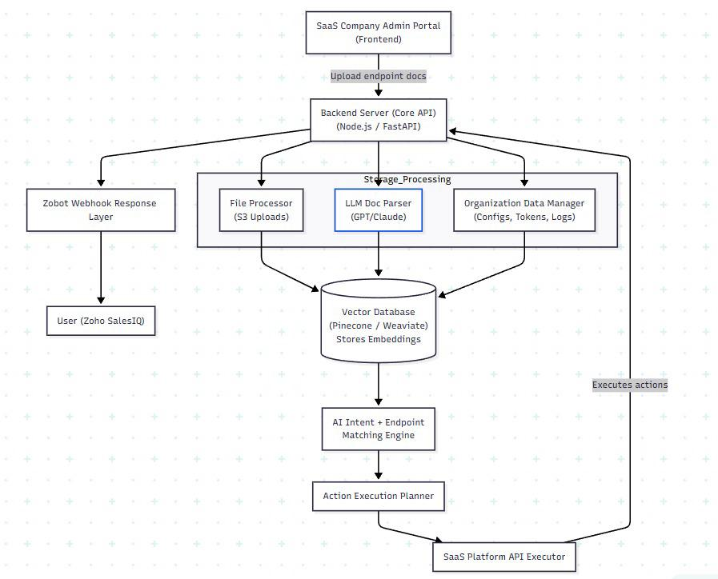

# 🤖 Chat2Act - Universal API Agent Bot

> **AI-Powered Universal API Agent for Zoho SalesIQ**

Transform natural language conversations into real API actions. Chat2Act allows any SaaS company to upload their API documentation, enabling users to perform real actions on their platform simply by chatting — similar to Amazon Q for AWS.

---

## 🎯 What It Does

The bot converts natural user messages like:

- *"Create a new user"*
- *"Update John's email to xyz@example.com"*
- *"Delete order 1051"*
- *"Show all inactive users"*

Into **real API calls** to the SaaS platform — **automatically**.

> 💡 **The user never sees API docs, paths, payloads, or schemas.**  
> The bot fully understands, identifies the correct endpoint, extracts parameters, and executes the action.

---

## ✨ Key Features

| Feature | Description |
|---------|-------------|
| 🌐 **Works with ANY SaaS API** | Upload your docs → bot instantly understands the entire product |
| 🧠 **Zero Manual Intent Training** | No flow builders. No rule creation. Everything is auto-generated |
| 💬 **True NL → API Execution** | Universal action agent that converts chat to API calls |
| 🔗 **Zoho SalesIQ Integration** | Fully integrated via Webhooks |
| 🏢 **Multi-Tenant Architecture** | Supports many SaaS companies, each with their own API docs |

---

## 🔄 How It Works

### Phase 1: Upload API Documentation

The SaaS team uploads their:
- **OpenAPI / Swagger** (`.json`, `.yaml`)
- **GraphQL schema**
- **Postman Collection**
- **Simple JSON structure files**

The backend parses and stores this in:
- `ApiDocs`
- `ApiIndex`
- `IntentMapping`
- `VectorChunks` + **Pinecone Embeddings**

### Phase 2: AI Understanding Layer

The system automatically:
- ✅ Parses all API paths
- ✅ Generates business tags
- ✅ Creates intent → sub-intent mappings
- ✅ Creates example queries
- ✅ Embeds everything into Pinecone vector DB

### Phase 3: User Query Processing

```
┌─────────────────┐
│   User Query    │
│ "Create a user" │
└────────┬────────┘
         │
         ▼
┌─────────────────────────┐
│  1. Stance Detection    │ ← LLM determines: create, read, update, delete?
└────────┬────────────────┘
         │
         ▼
┌─────────────────────────┐
│  2. Semantic Search     │ ← Pinecone finds relevant API endpoints
└────────┬────────────────┘
         │
         ▼
┌─────────────────────────┐
│  3. Intent Mapping      │ ← Matches query to correct business use-case
└────────┬────────────────┘
         │
         ▼
┌─────────────────────────┐
│  4. Parameter Extract   │ ← LLM extracts: ID, filters, body fields
└────────┬────────────────┘
         │
         ▼
┌─────────────────────────┐
│  5. API Execution Plan  │ ← Builds final call: URL, params, body
└────────┬────────────────┘
         │
         ▼
┌─────────────────────────┐
│  6. Real API Call       │ ← Executes against SaaS platform
└────────┬────────────────┘
         │
         ▼
┌─────────────────────────┐
│  7. Response Format     │ ← JSON → Human-readable response
└─────────────────────────┘
```

---

## 🏗️ Architecture Overview

Chat2Act consists of two major architectural components:

### 1️⃣ Real-time Chat Message Processing Flow


This diagram illustrates how user messages from **Zoho SalesIQ Chat** are processed in real-time:

#### Flow Description:

1. **Entry Point**: User sends a message via **SalesIQ Chat**
2. **Webhook Reception**: Message is received by the **Express Server** via POST webhook
3. **Handler Type Detection**: System determines if it's a:
   - **Trigger** (new conversation start) → Routes to **Welcome Message**
   - **Message** (user query) → Routes to **SalesIQ Controller**

4. **Parallel Processing Branches**:

   **Branch A: Conversation Management**
   - **Conversation Service** → Manages conversation state
   - **MongoDB - ConversationState** → Stores conversation context and history
   
   **Branch B: AI Intent Processing**
   - **Intent Classification Service** → Identifies user intent
   - **Gemini AI** → Powers the intent understanding
   
   **Branch C: API Execution**
   - **OAuth Service** → Handles authentication with SaaS platforms
   - **MongoDB - UserToken** → Stores OAuth tokens securely
   - **External SaaS API** → Executes real API calls
   
   **Branch D: Action Processing**
   - **API Execution Service** → Orchestrates API calls based on identified intent

5. **Response**: Formatted response is sent back to **SalesIQ Chat**

#### Key Components:
- **Express Server**: Fast API gateway handling webhooks
- **Handler Type Logic**: Smart routing for triggers vs. messages
- **Conversation Service**: Maintains multi-turn conversation context
- **Intent Classification**: AI-powered understanding of user goals
- **Gemini AI**: LLM for natural language understanding
- **OAuth Service**: Secure token management for third-party API access
- **API Execution Service**: Translates intent into real API calls

---

### 2️⃣ Admin Portal & Document Processing Architecture



This diagram shows how **SaaS companies** onboard and how their API documentation is processed:

#### Flow Description:

1. **Admin Portal (Frontend)**:
   - SaaS company admins access the React-based portal
   - Upload API documentation (OpenAPI, Swagger, Postman, GraphQL schemas)

2. **Backend Server (Core API)**:
   - Built with **Node.js / FastAPI**
   - Orchestrates all document processing workflows

3. **Storage & Processing Layer** (Parallel Processing):

   **Path A: File Handling**
   - **File Processor (S3 Uploads)** → Stores original documentation files
   
   **Path B: AI Document Parsing**
   - **LLM Doc Parser (GPT/Claude)** → Extracts endpoints, parameters, schemas
   - Generates business tags and intent mappings
   
   **Path C: Organization Setup**
   - **Organization Data Manager** → Handles configs, OAuth tokens, organization logos
   - Stores in MongoDB

4. **Vector Database (Pinecone/Weaviate)**:
   - All parsed endpoints are embedded as 768-dimensional vectors
   - Enables semantic search for intent matching

5. **AI Processing Pipeline**:
   
   **Step 1: Intent + Endpoint Matching**
   - **AI Intent + Endpoint Matching Engine** → Uses vector similarity to match user queries to relevant endpoints
   
   **Step 2: Planning**
   - **Action Execution Planner** → Constructs the API call with correct parameters
   
   **Step 3: Execution**
   - **SaaS Platform API Executor** → Makes the actual API call to the customer's platform

6. **Feedback Loop**:
   - Execution results are logged back to the **Organization Data Manager**
   - Used for continuous improvement and debugging

7. **Zobot Webhook Response Layer**:
   - Formats execution results for Zoho SalesIQ
   - Sends webhook responses back to the user via **User (Zoho SalesIQ)**

#### Key Components:
- **Admin Portal**: Self-service UI for SaaS companies
- **File Processor**: Handles S3 uploads for documentation storage
- **LLM Doc Parser**: Uses GPT/Claude to intelligently parse API docs
- **Vector Database**: Semantic search backbone (Pinecone or Weaviate)
- **AI Matching Engine**: Finds the right endpoint for any user query
- **Action Planner**: Smart parameter extraction and payload construction
- **API Executor**: Executes real API calls on behalf of users

---

## 🛠️ Tech Stack

### Frontend
| Technology | Purpose |
|------------|---------|
| **React** | User interface for uploading documentation |
| **Vite** | Fast build tooling and HMR |

### Backend
| Technology | Purpose |
|------------|---------|
| **Node.js / Express** | API processing, LLM integration, webhook handling |
| **MongoDB** | ApiDocs, ApiIndex, IntentMapping, Vector metadata |
| **Pinecone** | Vector DB (768-dim embeddings) |

### AI / LLM
| Technology | Purpose |
|------------|---------|
| **Gemini / GPT** | Stance detection, Intent generation, Endpoint reasoning, Parameter extraction, Response summarization |

---

## 📁 Project Structure

```
chat2act/
├── backend/
│   ├── controllers/     # Request handlers
│   ├── models/          # MongoDB schemas
│   ├── routes/          # API routes
│   ├── services/        # Business logic & LLM integrations
│   └── server.js        # Express server entry point
│
├── frontend/
│   ├── src/
│   │   ├── components/  # React components
│   │   └── App.jsx      # Main application
│   └── index.html       # Entry HTML
│
└── README.md
```

---

## 🚀 Getting Started

### Prerequisites

- Node.js (v18+)
- MongoDB
- Pinecone Account
- Zoho SalesIQ Account
- OpenAI / Google Gemini API Key

### Installation

1. **Clone the repository**
   ```bash
   git clone https://github.com/yourusername/chat2act.git
   cd chat2act
   ```

2. **Install Backend Dependencies**
   ```bash
   cd backend
   npm install
   ```

3. **Install Frontend Dependencies**
   ```bash
   cd ../frontend
   npm install
   ```

4. **Configure Environment Variables**
   
   Create a `.env` file in the `backend` directory:
   ```env
   PORT=3000
   MONGODB_URI=your_mongodb_connection_string
   PINECONE_API_KEY=your_pinecone_api_key
   PINECONE_INDEX=your_pinecone_index
   OPENAI_API_KEY=your_openai_key
   GEMINI_API_KEY=your_gemini_key
   ZOHO_CLIENT_ID=your_zoho_client_id
   ZOHO_CLIENT_SECRET=your_zoho_client_secret
   ZOHO_REDIRECT_URI=your_redirect_uri
   ```

5. **Start the Backend**
   ```bash
   cd backend
   npm run dev
   ```

6. **Start the Frontend**
   ```bash
   cd frontend
   npm run dev
   ```

---

## 🔌 Zoho SalesIQ Integration

### Webhook Setup

1. **Create a Webhook in Zoho SalesIQ**
   - Navigate to **Settings → Developer Space → Webhooks**
   - Create a new webhook pointing to your backend endpoint

2. **Configure OAuth**
   - Register your app in Zoho Developer Console
   - Set the redirect URI to match your backend callback route

3. **Start ngrok for Local Development**
   ```bash
   ngrok http 3000
   ```

---

## 📊 API Documentation

The backend includes Swagger documentation accessible at:
```
http://localhost:3000/api-docs
```

---

## 🎯 What Makes This Special

| Capability | Traditional Bots | Chat2Act |
|------------|------------------|----------|
| Intent Training | Manual flow builders | **Fully automated** |
| API Support | Single integration | **ANY SaaS API** |
| Parameter Handling | Rule-based | **AI-powered extraction** |
| Response Formatting | Template-based | **Natural language generation** |
| Scalability | Limited | **Multi-tenant ready** |

---

## 🎉 Final Outcome

Chat2Act is a **general-purpose AI agent** that allows ANY SaaS product to become **chat-driven**, with **real-time API execution** through Zoho SalesIQ.

### It Automates:
- ✅ Understanding user intent
- ✅ Mapping intent to API docs
- ✅ Selecting the correct endpoint
- ✅ Filling parameters intelligently
- ✅ Executing API calls
- ✅ Returning human-readable responses

> 🚀 **This is way beyond a normal customer-support bot — it's an intelligent action agent.**

---

## 📄 License

This project is licensed under the MIT License.

---

## 🤝 Contributing

Contributions are welcome! Please feel free to submit a Pull Request.

---

<p align="center">
  Built with ❤️ using AI + Zoho SalesIQ
</p>
